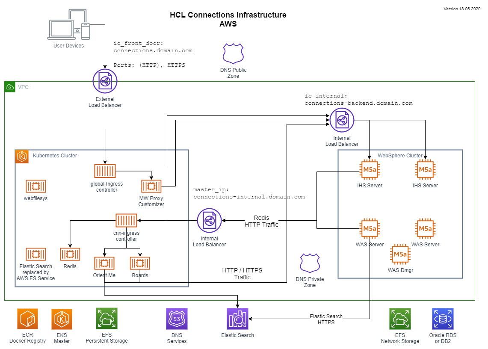

Create an HCL Connections Component Pack installation on managed Kubernetes
===========================================================================

HCL Connections Component Pack is based on Docker Images and should be deployed on a Kubernetes Cluster. The documentation lines out the installation on a private Kubernetes cluster only. This repository contains documentation and supporting scripts to deploy HCL Connections Component Pack on an AWS EKS Kubernetes Cluster.

In case there is interest, the documentation can be enhanced to document the installation on Azure AKS or Googles GKE.

This documentation provides information and installation guidelines to get HCL Connections Component Pack running on a managed Kubernetes service on one of the main cloud providers.

This repository is a successor of the previous installation instructions for IBM Connections Component Pack 6 and HCL Connections Component Pack 7.
The old repository can be found at [https://becketalservices.github.io/beas-cnx-cloud/](https://becketalservices.github.io/beas-cnx-cloud/)
 
Setup of Kubernetes Infrastructure
----------------------------------

__Amazon Web Services AWS__  

Instructions based on HCL Connections Component Pack Version 8.0  
[Installation instructions for Amazon Web Services](AWS/index.md)  
The installation uses AWS Services where ever possible.

Result and Network Overview
---------------------------

After following the __Amazon Web Services guide__ an infrastructure similar to this picture is running:

